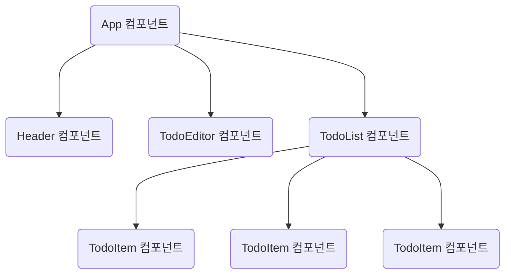
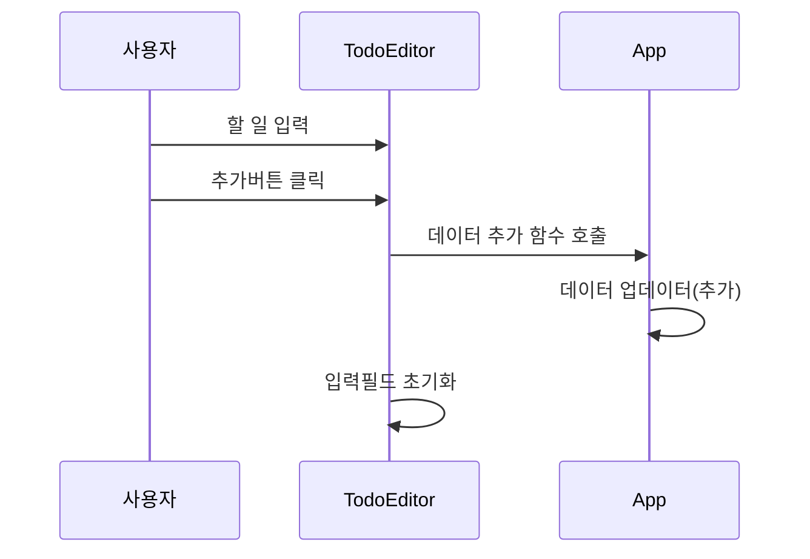
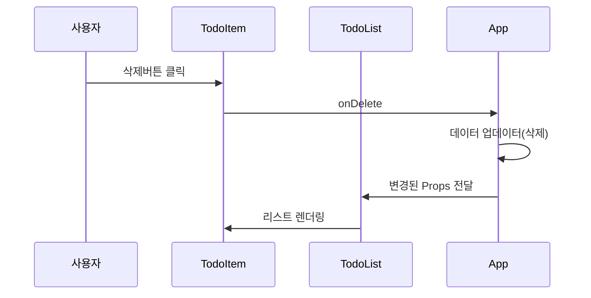

# 할 일 관리 앱

## 요구사항 분석하기
- 오늘의 날짜를 년도, 월, 일, 요일 순으로 표시한다.
- 할 일(Todo)을 작성하는 입력 폼이 있고, [추가]버튼을 클릭하면 할 일 아이템을 생성한다.
- [할 일 관리] 앱은 생성한 아이템을 페이지 하단에 리스트로 표시한다.
- 키워드 검색으로 원하는 할 일만 표시할 수 있다.
- 리스트로 표시하는 개별 할 일 아이템은 완료 여부를 표시하는 체크박스, 제목, 등록날짜, [삭제]  버튼으로 구성된다.

## 주요 컴포넌트
- Header : 요늘을 날짜를 표시 형식에 맞게 보여준다.
- TodoEditor : 새로운 할 일 아이템을 등록한다.
- TodoList : 검색어에 맞게 필터링된 할 일 리스트를 렌더링한다.
- TodoItem : 개별 할 일 아이템은 기본 정보 외에도 체크박스, [삭제] 버튼이 있다. 체크박스를 클릭하면 할 일을 마쳤는지 여부가 토클된다. [삭제] 버튼을 클릭하면 해당 아이템이 삭제된다.



### 컴포넌트별 담당 기능
- App 컴포넌트
  + 할 일 데이터를 관리
- Header 컴포넌트
  + 오늘 날짜 표시
- TodoEditor 컴포넌트
  + 새로운 할 일 데이터 추가
- TodoList 컴포넌트
  + 할 일 목록 표시(검색 기능 포함)
- TodoItem 컴포넌트
  + 할 일 정보 표시(수정, 삭제 기능 포함)

## 기능 구현하기
### Create : 할 일 추가하기

할 일 추가 기능


1. 할 일 데이터 준비하기
```javascript
import { useState, useRef } from "react";

function App() {
  // useState로 todos 변수에 할 일 데이터를 저장하는 빈 배열 객체를 대입한다.
  const [todos, setTodos] = useState([]);

  // useRef로 컴포넌트에서 사용할 변수 관리하기
  // useRef로 관리하는 값은 값이 변해도 화면이 렌더링되지 않는다.
  // idRef는 할일 아이템의 일련번호를 관리하는 변수다.
  const idRef = useRef(0); 
}
```

2. 할 일 아이템 추가 함수 정의하기
```javascript
function App() {
  const[todos, setTodos] = useState([]);
  const idRef = useRef(0);

  // TodoEditor 컴포넌트에서 [추가]버튼을 클릭했을 때 실행될 onCreate 함수를 정의한다.
  const onCreate = (content) => {
    const todoItem = {
      id: idRef.current,  // idRef의 현재값을 새로 추가되는 할일 아이템의 일련번호로 지정한다.
      content,
      isDone: false,
      createdDate: new Date()
    }
    // 배열의 스프레드 연산자를 활용해서 TodoItem를 포함하는 새 배열을 만들어서 todos를 업데이트한다.
    // 새로 추가되는 할일 아이템은 배열의 첫번째 요소가 된다.
    setTodos([todoItem, ...todos]);
    idRef.current += 1;   // idRef의 현재값을 1 증가 시킨다.
  }
}
```

3. App 컴포넌트에서 작성한 onCreate 함수를 TodoEditor 컴포넌트에 Props로 전달하기
```javascript
function App() {
  return (
    <div>
      <Header />
      <!--Props로 TodoEditor 컴포넌트에 onCreate 함수를 전달한다.-->
      <TodoEditor onCreate={onCreate}/>
      <TodoList />
    </div>
  );
}
```

4. TodoEditor 컴포넌트에서 할 일을 입력하고 [추가]버튼을 클릭해서 할 일을 추가하기
```javascript
import { useState } from "react";

// TodoEditor 컴포넌트에서 Props로 전달된 onCreate 함수를 받는다.
const TodoEditor = ({ onCreate }) => {
  // TodoEditor 컴포넌트에서 사용자가 입력한 할일 내용을 정보를 관리하기 위해서 useState함수로 content를 초기화한다.
  const [content, setContent] = useState("");
  // 입력필드의 값이 변경될 때 마다 실행되는 이벤트 핸들러 함수를 정의한다.
  // 이벤트 핸들러 함수에서는 입력필드의 값으로 content변수의 값을 변경한다.
  const onChangeContent = (e) => {
    setContent(e.target.value);
  }
  // 추가 버튼을 클릭했을 때 실행되는 이벤트 핸들러 함수를 정의한다.
  // Props로 전달받은 onCreate 함수를 호출하고 인자로 content 변수의 값을 전달한다.
  // 다음 입력을 위해서 입력필드의 값을 초기화한다.
  const onSubmit = () => {
    onCreate(content);
    setContent("");
  }

  return (
    <div className="TodoEditor">
      <h4>새로운 Todo 작성하기</h4>
      <div className="editor_wrapper">
         <!-- 입력폼의 value 속성으로 content 값을 설정하고, onchange이벤트에 대한 이벤트 핸들러를 설정한다. -->
        <input type="text" 
          value={content}  
          onChange={onChangeContent} 
          placeholder="새로운 Todo..." />
        <button onClick={onSubmit}>추가</button>
      </div>
    </div>
  );
}
```

5. 입력필드가 비어 있을 때 할일 등록 방지하기
```java
  import { useState, useRef } from "react";

const TodoEditor = ({ onCreate }) => {
  const [content, setContent] = useState("");
  // 할일 입력필드를 관리하기 위해 Ref 객체를 생성하고, 입력필드와 연결한다.
  const contentRef = useRef()

  const onChangeContent = (e) => {
    setContent(e.target.value);
  }

  const onSubmit = () => {
    // content 변수의 값이 비어있으면 경고창을 표시하고, 해당 입력필드에 포커스를 위치시킨다.
    if (!content) {
      alert("할 일을 입력하세요.");
      // contentRef가 현재값으로 저장한 엘리먼트에 포커스를 위치시킨다.
      contentRef.current.focus();
      return;
    }
    onCreate(content);
    setContent("");
  }

  return (
    <div className="TodoEditor">
      <h4>새로운 Todo 작성하기</h4>
      <div className="editor_wrapper">
        <!-- 입력필드을 조작하기 위해서 ref 속성으로 contentRef를 설정한다.-->
        <input type="text" 
          ref={contentRef} 
          value={content} 
          onChange={onChangeContent} 
          placeholder="새로운 Todo..." />
        <button onClick={onSubmit}>추가</button>
    </div>
    </div>
  );
}
```

6. [Enter] 키를 눌러서 아이템 추가하기
```javascript
import { useState, useRef } from "react";

const TodoEditor = ({ onCreate }) => {
  const [content, setContent] = useState("");
  const contentRef = useRef()

  const onChangeContent = (e) => {
    setContent(e.target.value);
  }
  // 입력필드에서 키가 눌려질 때마다 실행되는 이벤트 핸들러를 정의한다.
  const onKeyDown = (e) => {
    // 사욘자가 누른 키보드의 키값이 Enter 키를 의미하는 13과 동일하면 onSubmit() 이벤트 핸들러 함수를 호출한다.
    if (e.keyCode === 13) {
      onSubmit();
    }
  }
  const onSubmit = () => {
    if (!content) {
      alert("할 일을 입력하세요.");
      contentRef.current.focus();
      return;
    }
    onCreate(content);
    setContent("");
  }

  return (
    <div className="TodoEditor">
      <h4>새로운 Todo 작성하기</h4>
      <div className="editor_wrapper">
        <!--onkeydown 이벤트 발생시 실행할 이벤트 핸들러 함수를 등록한다.-->
        <input type="text" 
          ref={contentRef} 
          value={content} 
          onChange={onChangeContent} 
          onKeyDown={onKeyDown}
          placeholder="새로운 Todo..." />
        <button onClick={onSubmit}>추가</button>
      </div>
    </div>
  );
}
```

### Read : 할 일 리스트 렌더링하기
1. App 컴포넌트에서 Props로 TodoList 컴포넌트에 할 일 목록 데이터를 전달한다.
```javascript
import { useState, useRef } from "react";

function App() {
  const [todos, setTodos] = useState([]);

  return (
    <div className="App">
      <Header />
      <TodoEditor onCreate={onCreate}/>
      <!-- TodoList 컴포넌트에 Props로 할일 목록정보를 전달한다. -->
      <TodoList todos={todos} />
    </div>
  );
}
```

2. TodoList 컴포넌트에서 map 메소드를 사용해서 HTML 엘리먼트를 렌더링한다.
```javascript
// App컴포넌트가 Props로 전달한 할일목록정보를 전달받는다.
const TodoList = ({ todos  }) => {
  return (
    <div className="TodoList">
      <h4>Todo List</h4>
      <input className="searchbar" 
        placeholder="검색어를 입력하세요" />
      <!--
        map 메소드를 이용해서 todos의 모든 요소를 순차적으로 순회하면 TodoItem 컴포넌트로 변환한다. 
        TodoItem 컴포넌트에 할일정보를 스프레드 연산자를 이용해서 Props로 전달한다.
        리스트에서 각각의 컴포넌트를 식별하기 위해서 key 속성을 추가한다.
        리액트는 컴포넌트를 수정, 추가, 삭제할때 각각의 컴포넌트들을 구분하기 위해서 고유한 key값이 필요하다.
      -->
      <div className="list_wrapper">
        {todos.map(todo => (
          <TodoItem {...todo} key={todo.id}  />
        ))}
      </div>
    </div>
  )
}
```

```javascript
// TodoList 컴포넌트에서 전달한 할일 정보를 Props로 전달받는다.
const TodoItem = ({ id, content, idDone, createDate, onUpdate, onDelete }) => {
  return (
    <div className="TodoItem">
      <div className="checkbox_col">
        <input type="checkbox" checked={idDone} />
      </div>
      <div className="title_col">{content}</div>
      <div className="date_col">{moment(createDate.getTime()).format("YYYY년 M월 D일 dddd")}</div>
      <div className="btn_col">
        <button >삭제</button>
      </div>
    </div>
  );
}
```

3. 검색어에 따라서 할일 목록 필터링하기
```java
import { useState } from "react";
const TodoList = ({ todos, onUpdate, onDelete }) => {
  // TodoList 컴포넌트에서 검색어 입력필드에서 사용자가 입력한 값을 관리하기 위해서 useState로 keyword 변수를 생성하고, 입력필드와 연결한다.
  const [keyword, setKeyword] = useState("");
  // 검색어 입력필드의 입력값이 변경될 때마다 실행할 이벤트 핸들러 함수를 등록한다.
  const onChangeSearch = (e) => {
    // 입력필드에서 입력한 값을 읽어서 keyword 값을 변경한다.
    setKeyword(e.target.value);
  };

  // keyword가 관리하는 값으로 할일 목록을 필터링해서 반환한다.
  const getSearchResult = () => {
    return keyword === "" 
      ? todos 
      : todos.filter((todo) => todo.content.toLowerCase().includes(keyword.toLowerCase()));
  };
  return (
    <div className="TodoList">
      <h4>Todo List</h4>
      <input value={keyword} 
        onChange={onChangeSearch}
        className="searchbar" 
        placeholder="검색어를 입력하세요" />
      <!-- getSearchResult() 함수를 호출해서 획득한 할일 목록으로 TodoItem 컴포넌트를 생성한다. -->
      <div className="list_wrapper">
        {getSearchResult().map(todo => (
            <TodoItem {...todo} key={todo.id}  />
        ))}
      </div>
    </div>
  )
}
```

### Update : 할 일 수정하기

할 일 수정하기 


1. App 컴포넌트에 할일정보를 수정하는 함수를 정의하기
```javascript
function App() {
  const [todos, setTodos] = useState([]);
  // onUpdate 함수는 인자로 전달받은 아이템 아이디에 해당하는 할일 정보의 완료여부를 수정하는 함수다.
  // TodoItem 컴포넌트의 체크박스가 선택/해제됐을 때 호출해야 함으로 Props로 TodoItem 컴포넌트로 전달한다.
  const onUpdate = (todoId) => {
    setTodos(todos.map(todo => todo.id === todoId ? {...todo, isDone:!todo.isDone} : todo))
  };
  return (
    <div className="App">
      <Header />
      <TodoEditor onCreate={onCreate}/>
      <!-- onUpdate 함수를 Props로 TodoList 컴포넌트로 전달한다.-->
      <TodoList todos={todos} onUpdate={onUpdate}/>
    </div>
  );
}
```

2. TodoItem  컴포넌트에서 체크박스를 선택/해제 할 때마다 onUpdate 함수를 호출한다.
```javascript
// Props로 onUpdate 함수를 전달받는다.
const TodoItem = ({ id, content, idDone, createDate, onUpdate }) => {
  // onChangeChecked 함수는 체크박스가 선택/해제될 때마다 실행되는 이벤트 핸들러 함수다.
  // Props로 전달받은 onUpdate 함수를 호출하고, 인자로 할일 아이디를 전달한다.
  const onChangeChecked = () => {
    onUpdate(id);
  };

  return (
    <div className="TodoItem">
      <div className="checkbox_col">
        <!--onchange 이벤트가 발생할 때마다 onChangeChecked 함수를 호출한다.-->
        <input type="checkbox" checked={idDone}
          onChange={onChangeChecked}/>
      </div>
      <div className="title_col">{content}</div>
      <div className="date_col">{moment(createDate.getTime()).format("YYYY년 M월 D일 dddd")}</div>
      <div className="btn_col">
        <button >삭제</button>
      </div>
    </div>
  );
}
```

### Delete : 할 일 삭제하기

할 일 삭제하기


1. App 컴포넌트에 할일정보를 삭제하는 함수를 정의하기
```javascript
function App() {
  const [todos, setTodos] = useState([]);
  // 인자로 전달받은 할일 아이디에 해당하는 할일정보를 삭제하는 함수를 정의하고, Props로 TodoItem 컴포넌트로 전달한다.
  const onDelete = (todoId) => {
    setTodos(todos.filter(todo => todo.id != todoId));
  };

  return (
    <div className="App">
      <Header />
      <TodoEditor onCreate={onCreate}/>
      <TodoList todos={todos} onUpdate={onUpdate} onDelete={onDelete}/>
    </div>
  );
}
```

2. TodoItem 컴포넌트에서 삭제버튼을 클릭할 때마다 onDelete 함수를  호출한다.
```javascript
const TodoItem = ({ id, content, idDone, createDate, onUpdate, onDelete }) => {
  // 삭제버튼을 클릭할 때 마다 실행되는 이벤트 핸들러 함수를 정의한다.
  const onClickDelete = () => {
    // Props로 전달받은 onDelete 함수를 호출하고 인자로 할일 아이디를 전달한다.
    onDelete(id);
  };

  return (
    <div className="TodoItem">
      <div className="checkbox_col">
        <input type="checkbox" checked={idDone}
          onChange={onChangeChecked}/>
      </div>
      <div className="title_col">{content}</div>
      <div className="date_col">{moment(createDate.getTime()).format("YYYY년 M월 D일 dddd")}</div>
      <div className="btn_col">
        <!--버튼에서 onclick 이벤트 발생시 onClickDelete 함수를 호출한다.-->
        <button onClick={onClickDelete}>삭제</button>
      </div>
    </div>
  );
}
```